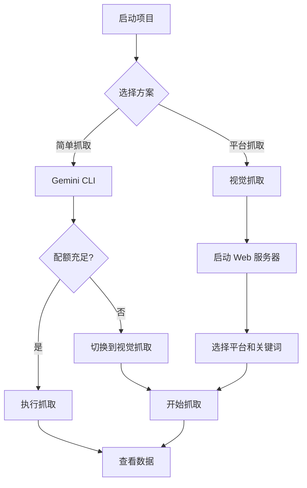

# 超级数据 - 使用指南

## 📊 两种抓取方案

### 方案 1：Gemini CLI 抓取（传统方案）

**优点：**
- 快速简单
- 命令行操作
- 适合批量抓取

**限制：**
- ⚠️ **免费版每天只有 20 次请求**
- 配额用完后需等待 24 小时重置
- 不支持动态页面和验证码

**使用方法：**
```bash
# 单页面抓取
node scraper.js fetch "https://example.com"

# 搜索关键词
node scraper.js search "关键词" --platform="小红书"

# 趋势分析
node scraper.js trends "话题" --days=7
```

**配额用完时的错误：**
```
❌ QUOTA_EXCEEDED: Gemini API 每日配额已用完（免费版限制 20 次/天）
```

---

### 方案 2：视觉抓取（推荐）⭐

**优点：**
- ✅ **无配额限制**（使用 Claude Vision API）
- 支持微博、小红书、抖音等平台
- 绕过反爬虫机制
- 自动处理验证码（抖音滑块）
- 结构化数据提取

**限制：**
- 需要 Claude API Key
- 速度稍慢（截图 + AI 分析）

**使用方法：**
1. 启动 Web 服务器
```bash
node platform-server.js
```

2. 打开浏览器访问
```
http://localhost:8080
```

3. 选择"视觉抓取"模式
   - 平台：微博/小红书/抖音
   - 关键词：搜索内容
   - 数量：最多抓取条数

4. 点击"开始抓取"

---

## 🔑 API 配置

### Gemini API Key

1. 访问 [Google AI Studio](https://aistudio.google.com/app/apikey)
2. 创建 API Key
3. 添加到 `.env` 文件：
```bash
GEMINI_API_KEY=your_api_key_here
```

**免费版配额：**
- 每天 20 次请求
- 每分钟 2 次请求
- 查看配额：[Google AI Console](https://ai.google.dev/rate-limit)

**升级到付费版：**
- 访问 [Google Cloud Console](https://console.cloud.google.com/)
- 开启 Vertex AI API
- 配额提升到 1000+ 次/天

---

### Claude API Key

1. 访问 [Anthropic Console](https://console.anthropic.com/)
2. 创建 API Key
3. 添加到 `.env` 文件：
```bash
ANTHROPIC_API_KEY=sk-ant-xxx
ANTHROPIC_BASE_URL=https://api.anthropic.com  # 可选，使用官方地址
```

**推荐使用场景：**
- 视觉抓取（无头浏览器 + Claude Vision）
- AI 报告生成
- 数据深度分析

---

## 🚨 配额用完怎么办？

### 方案 A：切换到视觉抓取
```bash
# 启动 Web 服务器
node platform-server.js

# 访问 http://localhost:8080
# 选择"视觉抓取"模式
```

### 方案 B：等待配额重置
- Gemini 免费版配额每天 0:00 UTC 重置
- 北京时间每天早上 8:00 重置

### 方案 C：升级付费版
- Gemini Pro API：$0.001/1K tokens
- Claude API：按需付费

---

## 📈 最佳实践

### 1. 合理规划配额
```bash
# 优先使用视觉抓取
curl -X POST http://localhost:8080/api/scrape-vision \
  -H "Content-Type: application/json" \
  -d '{"platform": "weibo", "keyword": "AI工具"}'

# Gemini 仅用于简单任务
node scraper.js fetch "https://example.com"
```

### 2. 批量任务分时处理
```bash
# 避免一次性用完配额
# 分散到多天执行
```

### 3. 使用缓存避免重复抓取
```bash
# 检查 data/ 目录是否已有数据
ls -lh data/
```

---

## 🐛 常见问题

### Q1: Gemini API 返回 429 错误？
**A:** 配额用完，使用视觉抓取或等待重置。

### Q2: 抖音抓取失败？
**A:** 抖音有滑块验证，使用视觉抓取会自动处理。

### Q3: 数据文件是空的？
**A:** 检查 API Key 配置和配额状态。

### Q4: Claude API 返回 403？
**A:** 检查 ANTHROPIC_API_KEY 和余额。

---

## 📞 支持

- GitHub Issues: [提交问题](https://github.com)
- 技术文档: [README.md](./README.md)
- API 文档: [INTEGRATION_SUMMARY.md](./INTEGRATION_SUMMARY.md)

---

## 🎯 推荐使用流程



**建议：优先使用视觉抓取，Gemini 作为备用方案。** ✅
